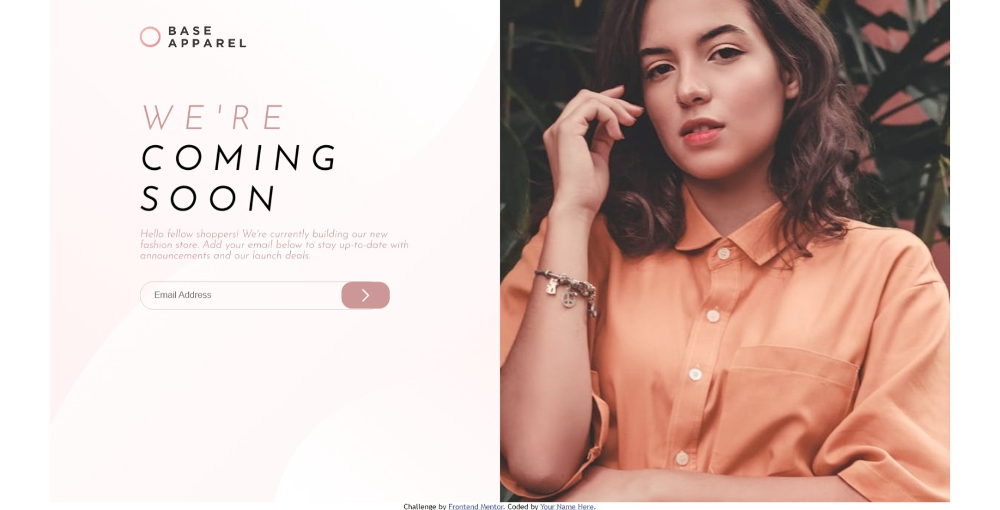

# Frontend Mentor - Base Apparel coming soon page solution

This is a solution to the [Base Apparel coming soon page challenge on Frontend Mentor](https://www.frontendmentor.io/challenges/base-apparel-coming-soon-page-5d46b47f8db8a7063f9331a0). Frontend Mentor challenges help you improve your coding skills by building realistic projects.

## Table of contents

- [Overview](#overview)
  - [The challenge](#the-challenge)
  - [Screenshot](#screenshot)
  - [Links](#links)
- [My process](#my-process)
  - [Built with](#built-with)
  - [What I learned](#what-i-learned)
- [Author](#author)

## Overview

### The challenge

Users should be able to:

- View the optimal layout for the site depending on their device's screen size
- See hover states for all interactive elements on the page
- Receive an error message when the `form` is submitted if:
  - The `input` field is empty
  - The email address is not formatted correctly

### Screenshot



### Links

- Solution URL: [Solution URL](https://github.com/Codedzephyr/Base-apparel-design)
- Live Site URL: [Live Site URL](https://modest-euclid-02fded.netlify.app/)

## My process

### Built with

- Semantic HTML5 markup
- CSS custom properties
- Flexbox
- CSS Grid
- Mobile-first workflow

### What I learned

```html
<div class="form">
  <form>
    <input
      type="text"
      id="email"
      name="email address"
      placeholder="Email Address"
    />
    <div class="icon-container">
      
      
    </div>
  </form>
</div>
```

```css
.content-container {
  width: 100%;
  background-image: url(./images/bg-pattern-desktop.svg), linear-gradient(135deg, hsl(0, 0%, 100%), hsl(0, 100%, 98%));
  background-size: cover;
  background-position: center;
  background-repeat: no-repeat;
  display: flex;
  justify-content: center;
  align-items: center;
}
```

```js
var regex =
  /^(([a-zA-Z0-9_\-\.]+)@([a-zA-Z0-9_\-\.]+)\.([a-zA-Z]{2,5}){1,25})+([;.](([a-zA-Z0-9_\-\.]+)@{[a-zA-Z0-9_\-\.]+0\.([a-zA-Z]{2,5}){1,25})+)*$/;
```

## Author

- Website - [Salihu Andulhamid](https://infallible-pike-a0b433.netlify.app/)
- Frontend Mentor - [@Codedzephyr](https://www.frontendmentor.io/profile/Codedzephyr)
- Twitter - [@dimah](https://www.twitter.com/_dimah__)
